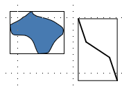

= R-Tree

运用了空间分割的理念

一棵树，父节点是对子节点范围的一个并集，叶子节点存储数据

image::v2-d6527a3dd1cfba5f6b963a6e4ad50da2_1440w.png[R-Tree原理]

== MBR

Minimum Bounding Box。

含义是用一个最小的矩形（通常默认矩形的边平行于坐标轴），框住不规则的几何体。

== 场景

=== 场景1

针对时间区间的查询

==== 常规

start_time + end_time 两条索引，分开去查会查到大量数据（即使 index-merge 生效）

==== 优化

类似于 GIS（地理信息） 的处理

将时间区间转化为坐标系中的线段（y=0），用 x = 0 的垂直直线去相交处理
