= day1

记录逻辑有序，利用已删除的空间

利用从库压缩已删除的空间

住

== 存储引擎

image::image-2021-08-09-20-33-52-832.png[记录存储]

已删除空间（标记删除）：自由空间。 +
连接起来就是自由空间链表 +

slot：一个个指针，指向记录 +

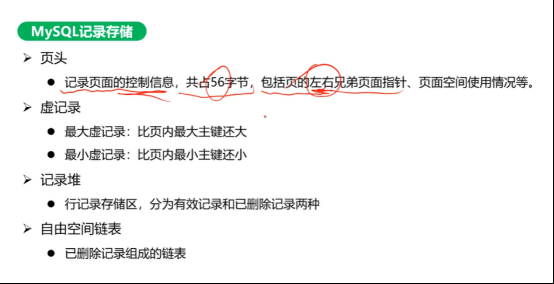

类似于跳表

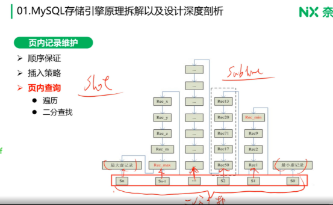

=== 存储引擎内存管理

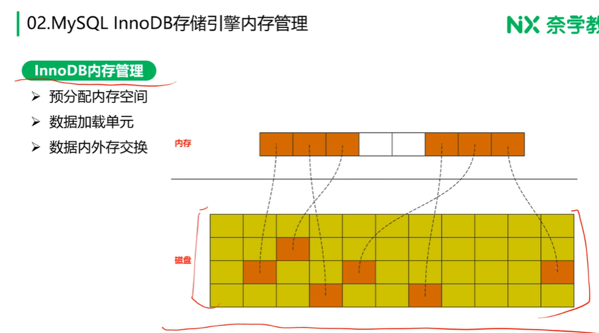

数据加载单元：一次加载一页，而不是一条 +
数据内外寸交换：（涉及淘汰算法、脏页） +

ps

. 脏页：内外存数据不一致

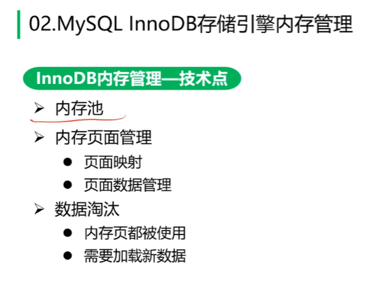

页面类型

==== LRU 内存淘汰

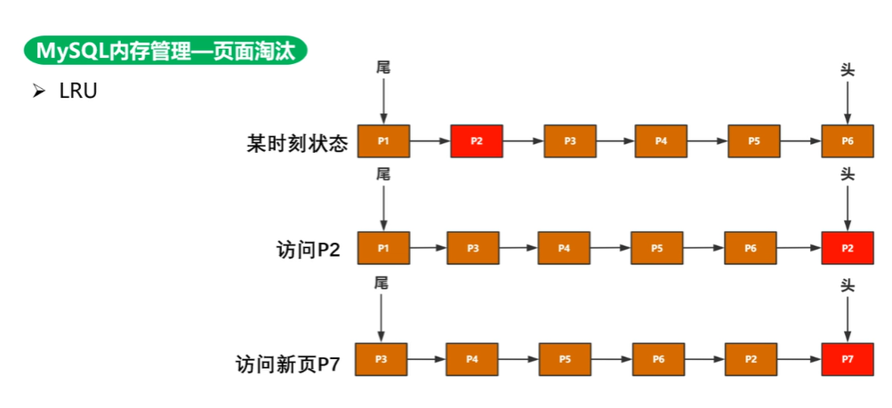

全表扫描对内存影响：导致缓存污染，淘汰了热点数据

InnoDB 不单是 LRU，避免淘汰热数据

解决方式：

. 时间 + 频率
. 两个 LRU，一个放热数据，一个放冷数据，满足条件移到热/冷 LRU

LFU：按访问频率

InnoDB 方式

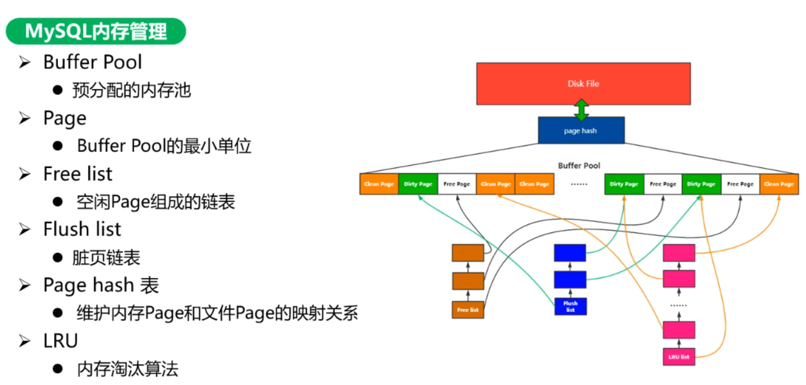

冷热分离

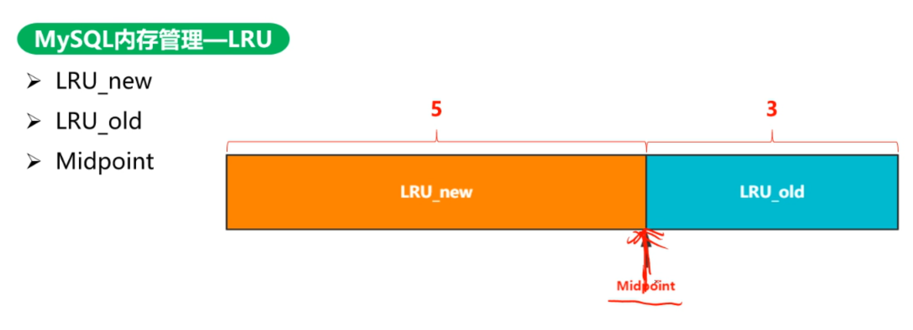

midpoint 指向 5/8

old -> new

innodb_old_blocks_time old 区大于此值，才有机会进去 new 区

new -> old 只需要保证 midpoint 在 5/8

== 锁实现机制

LRU 有锁情况

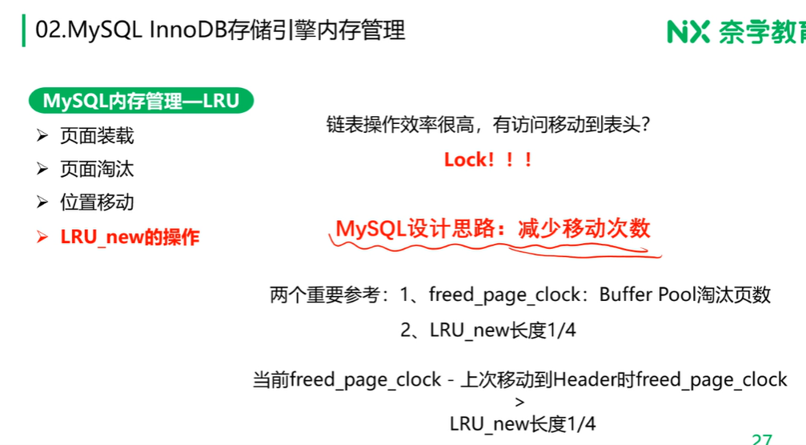

== 事务实现原理

=== MVCC 多版本并发控制

新版本存在指针指向旧版本

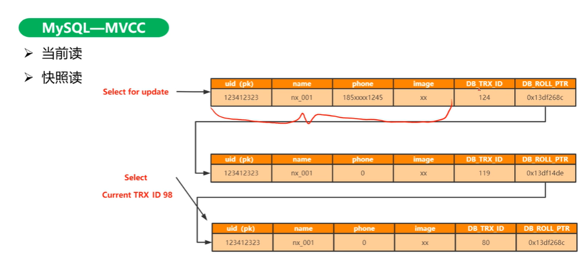

解决读写冲突

方式：

. 隐藏列

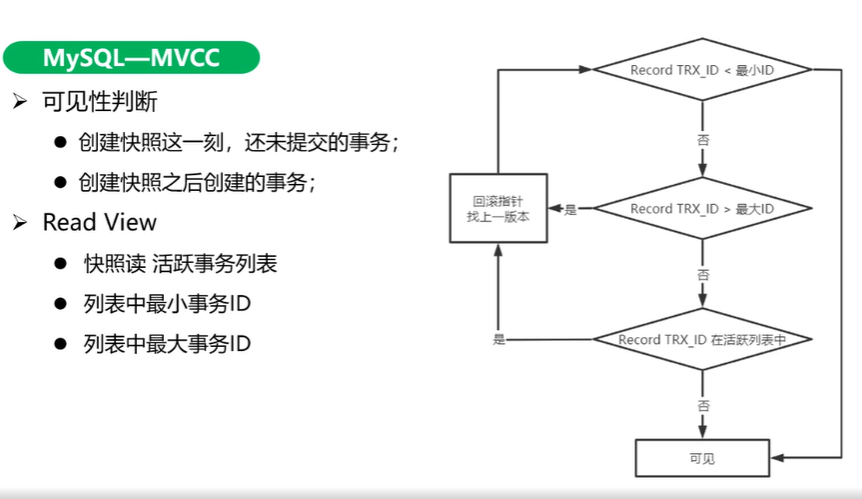

=== undo log

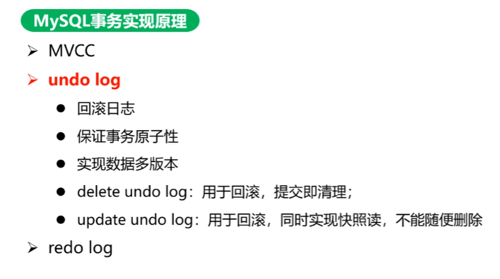

快照读，旧版本存在 undo log

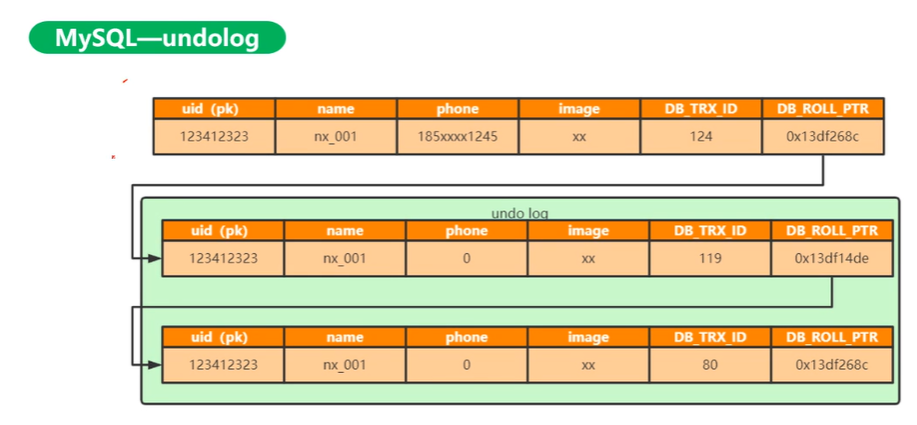

因为 MVVC 每个事务看到是数据不一样，所以得一条条数据去数

=== redo log

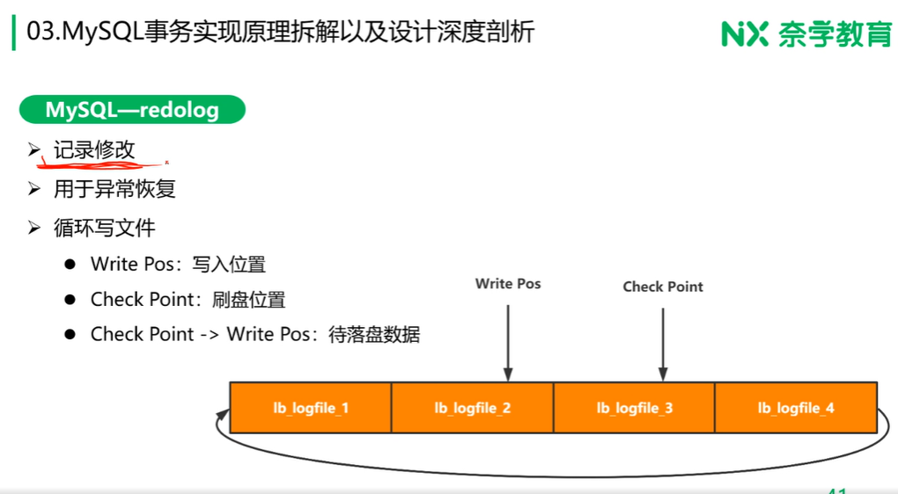

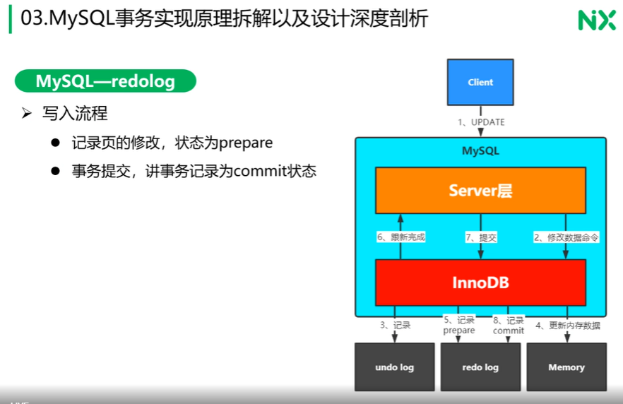

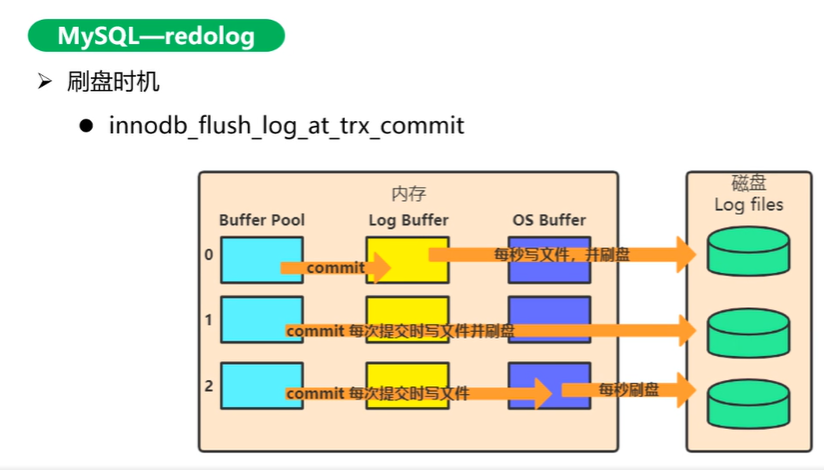

0： 数据库崩溃丢 1 秒 +
2： 文件系统崩溃丢 1 秒 +

redo log 只写修改的部分，而不是写整个页

=== 锁实现原理

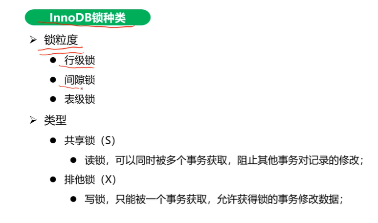

二级索引需要回表，覆盖索引无需回表

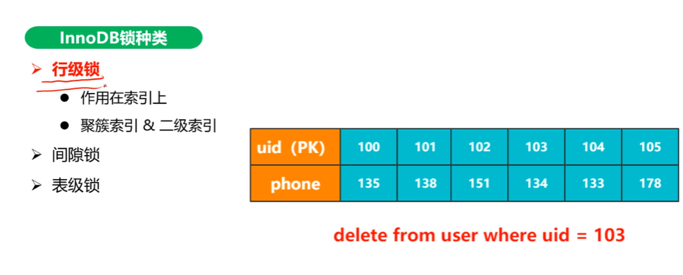

RC（读已提交）+ 非唯一索引

RR（可重复读）+ 非唯一索引，使用间隙锁

删 phone = 114，两条，又插入一条 114

间隙锁：锁区间，避免插入新的重复记录，如：phone = 114

保证两次当前读返回一直的记录

全表扫描回锁表

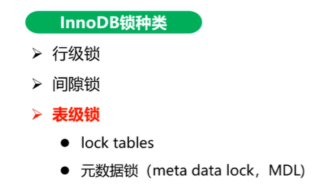

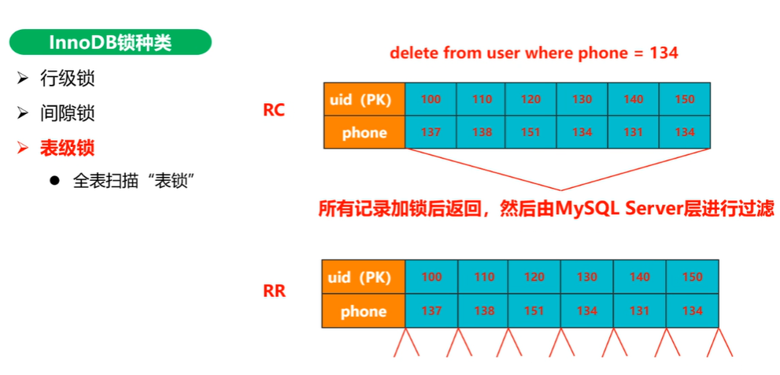

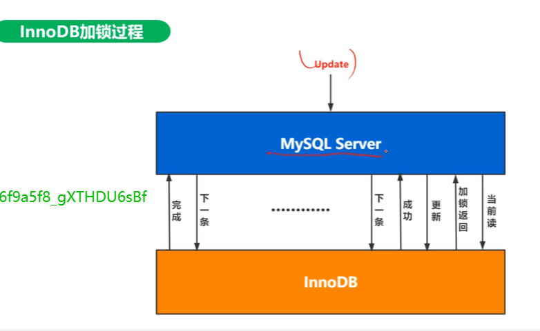

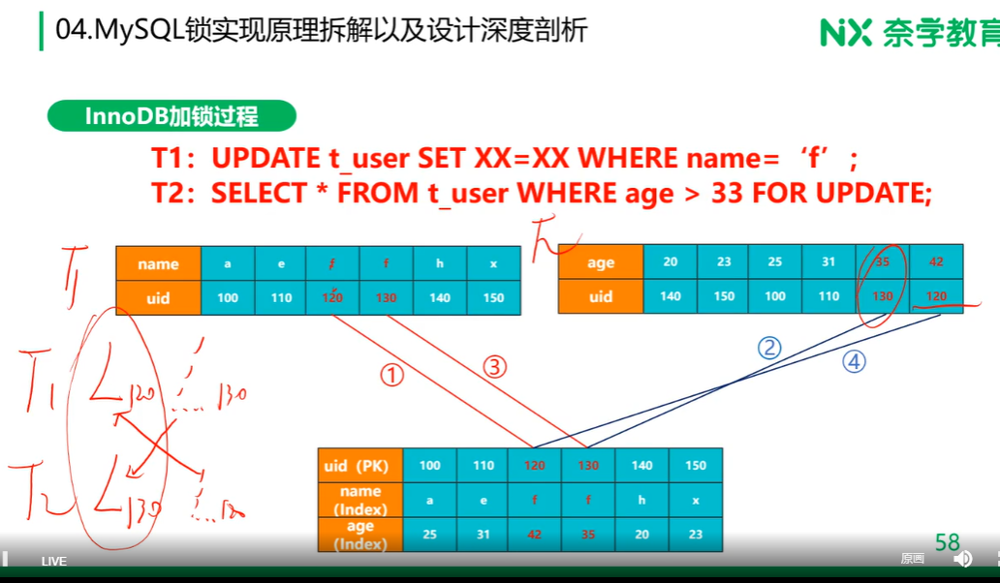
