= day2

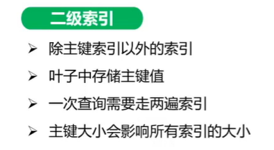

字符串按 ASCII 进行排序

image::image-2021-08-10-20-24-38-526.png[联合索引]

如果前面的列使用了范围查询，后面的列无法使用索引

hash 索引适合做点查询，不适合范围查询、排序

减少树的深度，减少磁盘 IO

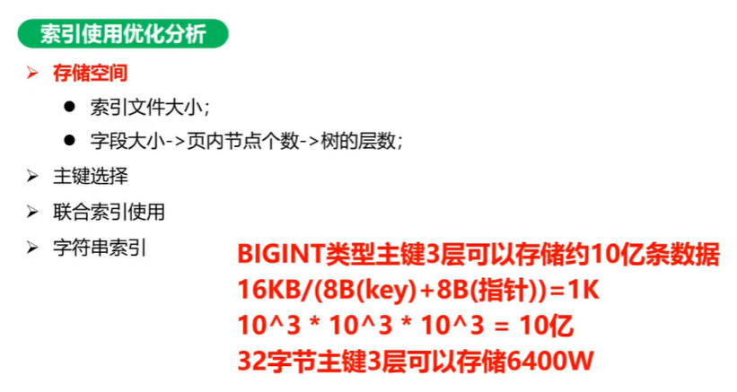

== 主键设计

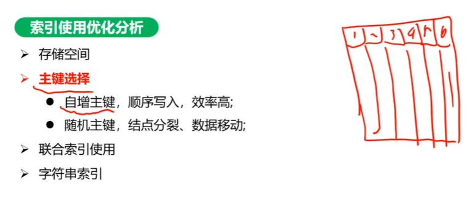

image::image-2021-08-10-20-43-35-021.png[主键选择]

按索引区分度排序：值类型多 +
索引下推：非主键索引 (name,age) 情况，不下推时第一次查询忽略 age，第二次通过 age 查询（需要回表），使用下推时，同时使用两个字段查询，since 5.6

    索引下推（index condition pushdown ）简称ICP，在Mysql5.6的版本上推出，用于优化查询。
    在不使用ICP的情况下，在使用非主键索引（又叫普通索引或者二级索引）进行查询时，存储引擎通过索引检索到数据，然后返回给MySQL服务器，服务器然后判断数据是否符合条件 。
    在使用ICP的情况下，如果存在某些被索引的列的判断条件时，MySQL服务器将这一部分判断条件传递给存储引擎，然后由存储引擎通过判断索引是否符合MySQL服务器传递的条件，只有当索引符合条件时才会将数据检索出来返回给MySQL服务器 。
    索引条件下推优化可以减少存储引擎查询基础表的次数，也可以减少MySQL服务器从存储引擎接收数据的次数。

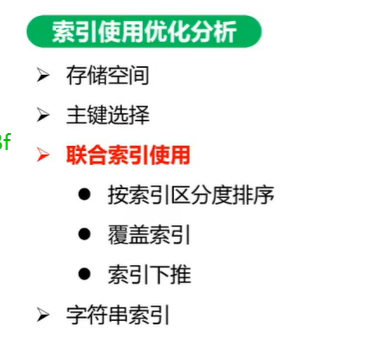

=== 索引失效情况：

==== OR

==== 隐式内存转换

==== 包含计算

==== 数据范围影响

. 区分度很低
. 超出索引范围，如：id > 0

MySQL 觉得全表更快

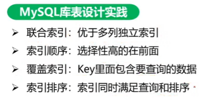

一个字节能描述 255 长度，超过 255 需要两个字节描述长度

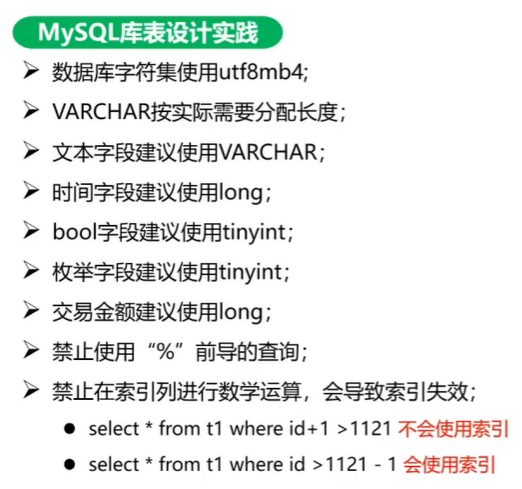

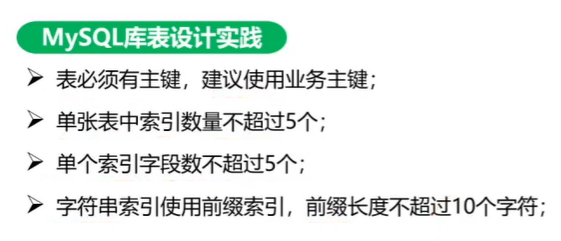

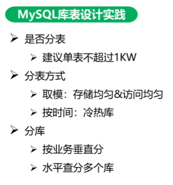

垂直拆分：拆宽表

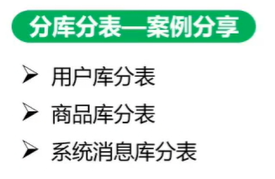

uid 对 128 取模，不利于 phone 查询，给 phone 和 uid 做一张关联表，要根据查询比例大的字段去分表

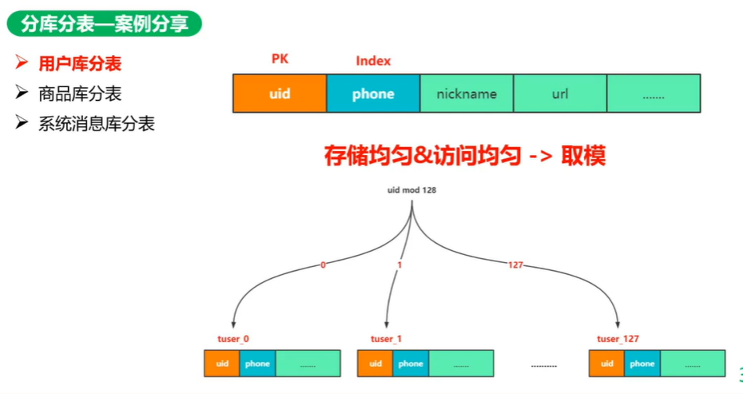

要查多表

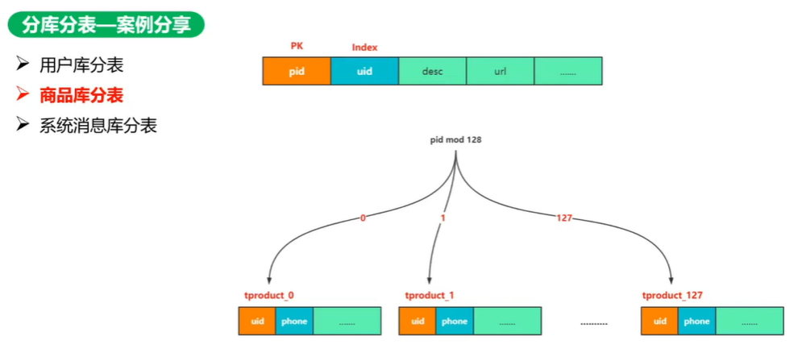

基因注入法：uid = id + pubId，根据 pubId 去分表，pubId 根据 pid 生成

pubId 只需要均匀，不需要唯一

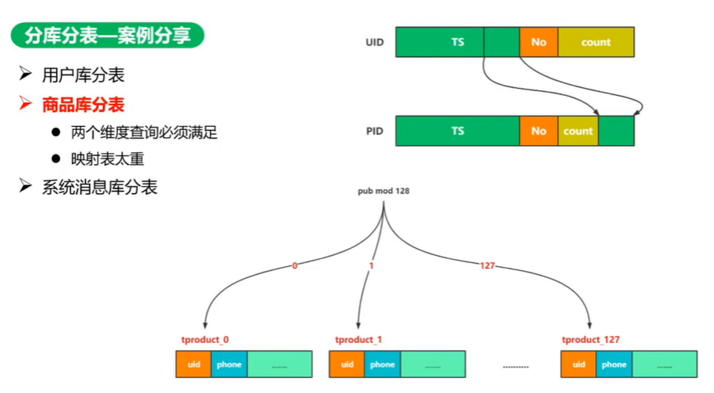

根据月份拆，涉及到跨月查询

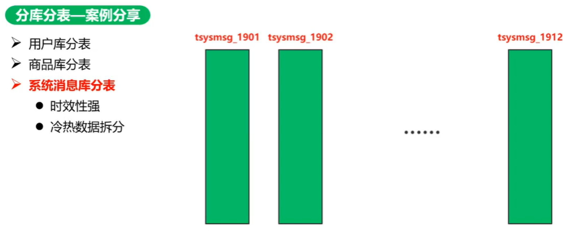

空间换时间，一张表写两个月数据（一个月数据写两个表，写两次）

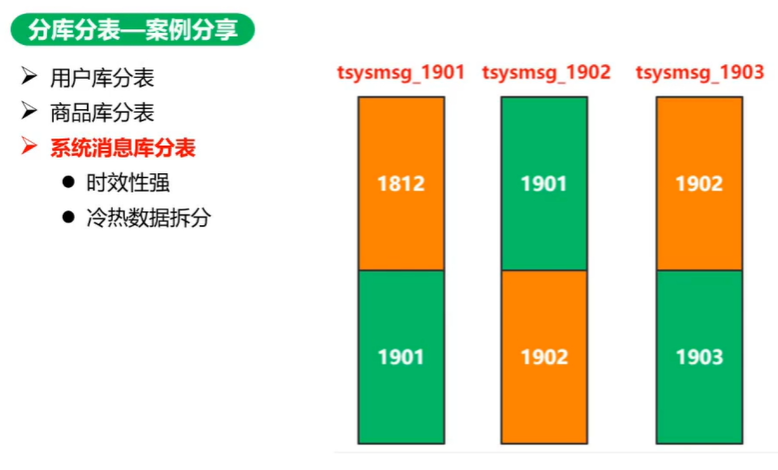

分表分少了咋办

mod 8，mod 16

数据：[0, 1, 2, 3, 4, 5, 6, 7] +

分表：mod 2 [0, 1]

* [0, 2, 4, 6]
* [1, 3, 5, 7]

扩展：mod 4 [0, 1, 3, 4]

* [0, 4] 原表 0，冗余数据：2， 6
* [1, 5] 原表 1，冗余数据：3， 7
* [2, 6] 全量拷贝原表 0，冗余数据：0， 4
* [3, 7] 全量拷贝原表 1，冗余数据：1， 5

后期再删除冗余数据

彼此多了一份数据用不到，不影响查

分表后存储和计算分离，数据库只做存储

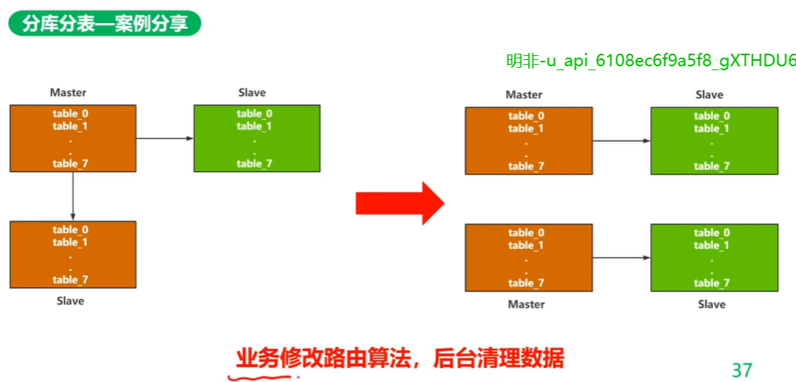
